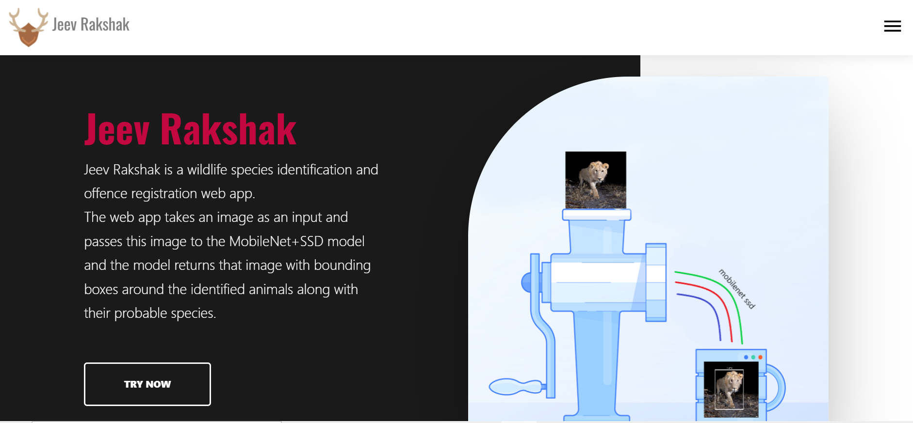
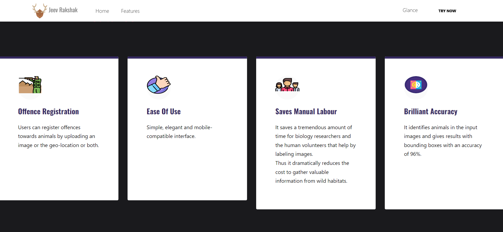
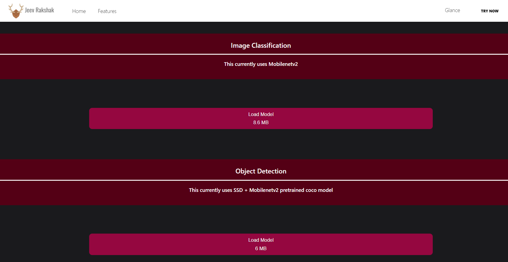
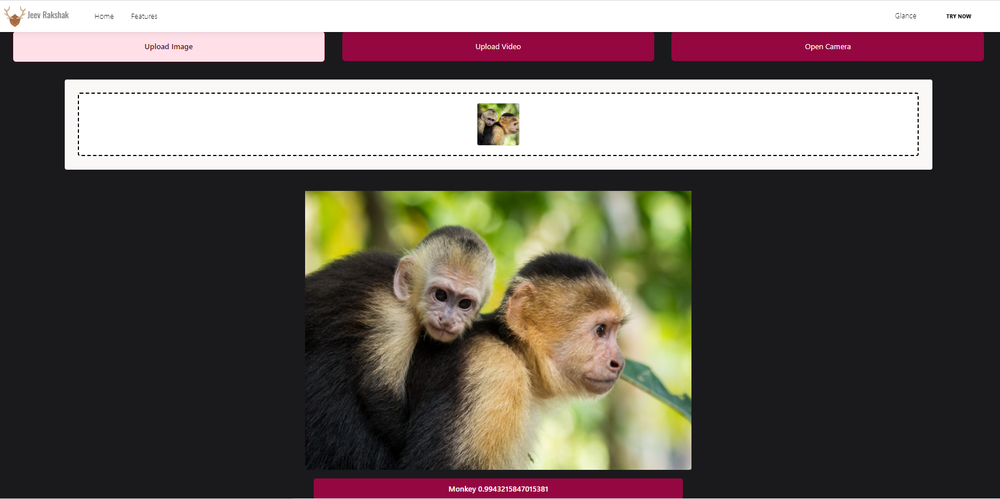
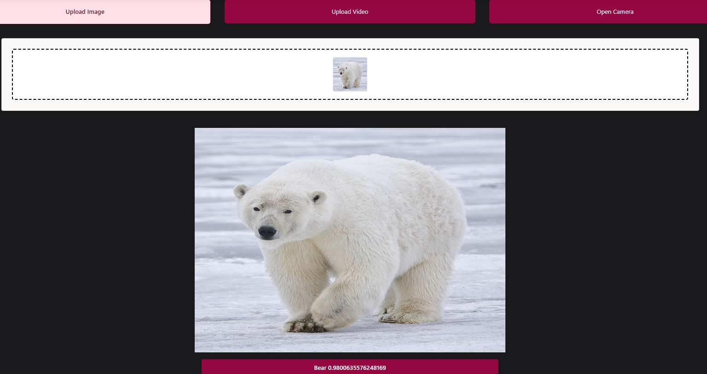



# Jeev Rakshak
Wildlife Species Identification using client-side Neural Networks


# Table of Contents

* [Description](https://github.com/amurto/jeev-rakshak#description)
* [Dependencies](https://github.com/amurto/jeev-rakshak#dependencies)
* [Installation](https://github.com/amurto/jeev-rakshak#installation)
  * [Prerequisites](https://github.com/amurto/jeev-rakshak#prerequisites)
  * [Instructions](https://github.com/amurto/jeev-rakshak#instructions)
* [Usage](https://github.com/amurto/jeev-rakshak#usage)
* [Contributors](https://github.com/amurto/jeev-rakshak#contributors)
* [License](https://github.com/amurto/jeev-rakshak#license)

# Description

Observing wild animals in their natural environments is a central task in ecology. The fast growth of human population and the endless pursuit of economic development are making over-exploitation of natural resources, causing rapid, novel and substantial changes to Earth’s ecosystems. Once fully charged, a camera can snap thousands of consecutive images, providing a large volume of data. These specifications make camera traps a powerful tool for ecologists as they can document every aspect of wildlife.

Various modern technologies have been developed for wild animal monitoring, including radio tracking, wireless sensor network tracking, satellite and global positioning system (GPS) tracking, and monitoring by motion sensitive camera traps. Motion-triggered remote cameras or "camera traps" are an increasingly popular tool for wildlife monitoring, due to their novel features equipped, wider commercial availability, and the ease of deployment and operation. To this end, a recently widely-used approach by ecologists is to set up several camera traps in the wild to collect image data of wild animals in their natural habitats.

The project aims to identify animals from images and videos using Deep Learning. 

We have implemented the following features as a part of this system:
* MobileNetv2 is a streamlined architecture that uses depthwise separable convolutions to construct lightweight deep convolutional neural networks and provides an efficient model for mobile and embedded vision applications. We have trained an image classification model by applying transfer learning on the coco MobileNetv2 pretrained model. It can classify the following species efficiently and accurately.
    * Butterfly
    * Elephant 
    * Tiger 
    * Lion 
    * Horse
    * Panda
    * Bear 
    * Monkey 
    * Dog
    * Deer
    * Person

* We trained an animal detection model on top of the Mobilenetv2-SSD pretrained coco weights using Tensorflow's Object Detection API. It can detect the following species. 
    * Person
    * Bird
    * Cat
    * Dog
    * Horse
    * Sheep
    * Cow
    * Elephant
    * Bear
    * Zebra
    * Giraffe
    
* These two models were converted into JavaScript supported GraphModels using the [Tensorflowjs Convertor](https://github.com/tensorflow/tfjs/tree/master/tfjs-converter).
* A React web app which can process input images and videos as well as a Realtime feature which uses the device camera to process frames and display the result on a canvas.
* The models for classification and detection have a size of 8.6 MB and 6 mB respectively, which it makes it easy and faster to load. The models are saved in the Indexed DB after loading them for the first time.
# Website








### Image Classification


### Object Detection


# Dependencies

* [TensorFlow.js](https://www.tensorflow.org/js)
* [Keras](https://keras.io/)
* [npm](https://www.npmjs.com/)
* [React.js](https://reactjs.org/)

# Installation

### Prerequisites

Install Node.js and npm using the link above. Follow instructions on their respective websites. Npm is included with Node.js

### Instructions

Clone the repository
```bash
git clone https://github.com/Omkar-here/Prani-Rakshak.git
```

Install all the dependencies
```bash
cd web_app 
npm install
```

# Usage

Run the project
```bash
cd web_app
npm start
```

Open a web browser and go to
```bash
http://localhost:3000
```


